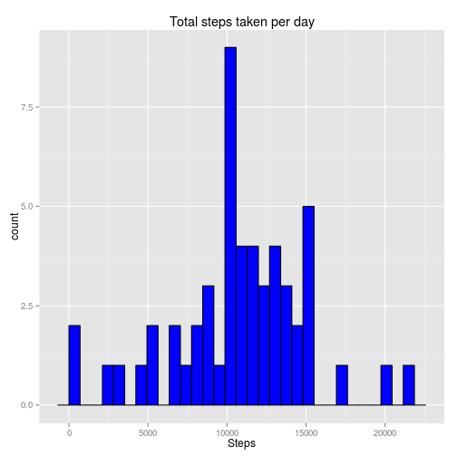
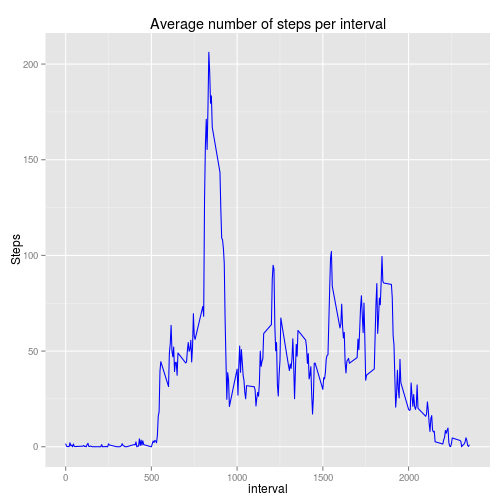
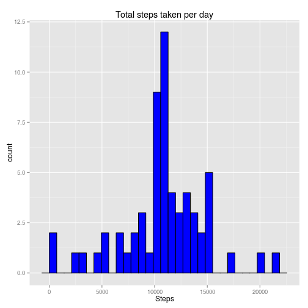
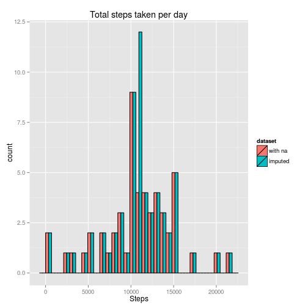
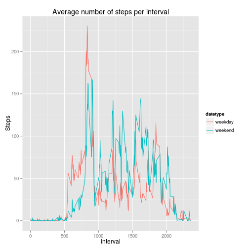
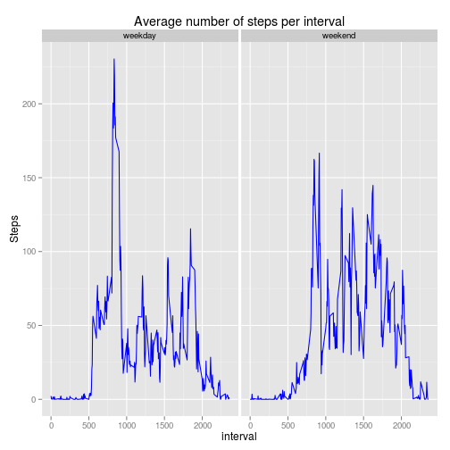

## Loading and preprocessing the data

Load this sucker (assuming that this is being knit from within the same
directory as "activity.zip" is stored):

```r
activity <- read.csv(unz("activity.zip", "activity.csv"))
```

Looks good 'nuff for me.

## What is mean total number of steps taken per day?

Because some entire days have no information regarding the number of steps, we
will filter out all NA before ddply-ing rather than in the `mean` and `sum`
functions (thus avoiding pesky `NaN`s)

```r
library(plyr)
notNA.activity <- activity[!is.na(activity$steps), ]
activity.by.day <- ddply(
  .data=notNA.activity,
  .variables=.(date),
  .fun=function(x) {
    c(
      total.steps=sum(x$steps),
      mean.steps=mean(x$steps),
      median.steps=median(x$steps)
    )
  }
)
```

Hisssssssssssstogram

```r
library(ggplot2)
ggplot(activity.by.day, aes(x=total.steps)) +
  geom_histogram(color="black", fill="blue") +
  xlab("Steps") +
  ggtitle("Total steps taken per day")
```

```
## stat_bin: binwidth defaulted to range/30. Use 'binwidth = x' to adjust this.
```

 

All right, all right, I'll report everything -- no need to be so `mean`.

```
##          date mean.steps median.steps
## 1  2012-10-02     0.4375            0
## 2  2012-10-03    39.4167            0
## 3  2012-10-04    42.0694            0
## 4  2012-10-05    46.1597            0
## 5  2012-10-06    53.5417            0
## 6  2012-10-07    38.2465            0
## 7  2012-10-09    44.4826            0
## 8  2012-10-10    34.3750            0
## 9  2012-10-11    35.7778            0
## 10 2012-10-12    60.3542            0
## 11 2012-10-13    43.1458            0
## 12 2012-10-14    52.4236            0
## 13 2012-10-15    35.2049            0
## 14 2012-10-16    52.3750            0
## 15 2012-10-17    46.7083            0
## 16 2012-10-18    34.9167            0
## 17 2012-10-19    41.0729            0
## 18 2012-10-20    36.0938            0
## 19 2012-10-21    30.6285            0
## 20 2012-10-22    46.7361            0
## 21 2012-10-23    30.9653            0
## 22 2012-10-24    29.0104            0
## 23 2012-10-25     8.6528            0
## 24 2012-10-26    23.5347            0
## 25 2012-10-27    35.1354            0
## 26 2012-10-28    39.7847            0
## 27 2012-10-29    17.4236            0
## 28 2012-10-30    34.0938            0
## 29 2012-10-31    53.5208            0
## 30 2012-11-02    36.8056            0
## 31 2012-11-03    36.7049            0
## 32 2012-11-05    36.2465            0
## 33 2012-11-06    28.9375            0
## 34 2012-11-07    44.7326            0
## 35 2012-11-08    11.1771            0
## 36 2012-11-11    43.7778            0
## 37 2012-11-12    37.3785            0
## 38 2012-11-13    25.4722            0
## 39 2012-11-15     0.1424            0
## 40 2012-11-16    18.8924            0
## 41 2012-11-17    49.7882            0
## 42 2012-11-18    52.4653            0
## 43 2012-11-19    30.6979            0
## 44 2012-11-20    15.5278            0
## 45 2012-11-21    44.3993            0
## 46 2012-11-22    70.9271            0
## 47 2012-11-23    73.5903            0
## 48 2012-11-24    50.2708            0
## 49 2012-11-25    41.0903            0
## 50 2012-11-26    38.7569            0
## 51 2012-11-27    47.3819            0
## 52 2012-11-28    35.3576            0
## 53 2012-11-29    24.4688            0
```

Though it looks odd at first, I believe the all-0 medians to be accurate -- the
vast majority of the time people are simply not taking steps.

## What is the average daily activity pattern?

Now we are more interested in the activity day-to-day, so let's re-ddply
ourselves.

```r
activity.by.interval <- ddply(
  .data=activity,
  .variables=.(interval),
  .fun=function(x) {
    c(
      ave.steps=mean(x$steps, na.rm=T),
      max.steps=max(x$steps, na.rm=T)
    )
  }
)
```

Hot to plot 

```r
ggplot(activity.by.interval, aes(x=interval, y=ave.steps)) +
  geom_line(color="blue", fill="blue") +
  ylab("Steps") +
  ggtitle("Average number of steps per interval")
```

 

Taking it to the max,

```r
max.all <- max(activity.by.interval$max.steps)
max.ave <- max(activity.by.interval$ave.steps)
interval.max.all <- activity.by.interval[activity.by.interval$max.steps == max.all, "interval"]
interval.max.ave <- activity.by.interval[activity.by.interval$ave.steps == max.ave, "interval"]
interval.diff <- interval.max.ave - interval.max.all
interval.as.time <- function(i) {
  x <- as.character(i)
  paste(
    substr(x, 1, nchar(x) - 2),
    substr(x, nchar(x) - 1, nchar(x)),
    sep=":"  
  )
}
```

To answer the specific question asked in this project description, the interval
which has the largest average number of steps (206.1698) during it across all
days is interval 8:35. For what it is worth,
this is over 2:20 away from the maximum number of
steps (806) taken in a **single** interval, taken on a single day within
interval 6:15. Looks like some early bird is
gettin that worm.

## Imputing missing values

In the activity data set, there are


```r
nrow(activity) - sum(complete.cases(activity))
```

```
## [1] 2304
```

rows with missing data in them.

We will replace all missing step data with the average number of steps in the
corresponding interval over all days which have data:


```r
activity.imputed <- activity
for (i in 1:nrow(activity.by.interval)) {
  interval <- activity.by.interval[i, "interval"]
  aveSteps <- activity.by.interval[i, "ave.steps"]
  toFix <- activity.imputed$interval == interval & is.na(activity.imputed$steps)
  activity.imputed[toFix, "steps"] <- aveSteps
}
```

After this step we have

```r
nrow(activity.imputed) - sum(complete.cases(activity.imputed))
```

```
## [1] 0
```

missing data points in our `activity.imputed` data frame.

Now, repeating the steps in part 1 with this `activity.imputed` data frame;


```r
activity.imputed.by.day <- ddply(
  .data=activity.imputed,
  .variables=.(date),
  .fun=function(x) {
    c(
      total.steps=sum(x$steps),
      mean.steps=mean(x$steps),
      median.steps=median(x$steps)
    )
  }
)
```

Hisssssssssssstogram part deux

```r
ggplot(activity.imputed.by.day, aes(x=total.steps)) +
  geom_histogram(color="black", fill="blue") +
  xlab("Steps") +
  ggtitle("Total steps taken per day")
```

```
## stat_bin: binwidth defaulted to range/30. Use 'binwidth = x' to adjust this.
```

 

All right, all right, I'll report everything *again* -- no need to be so `mean`.

```
##          date mean.steps median.steps
## 1  2012-10-01    37.3826        34.11
## 2  2012-10-02     0.4375         0.00
## 3  2012-10-03    39.4167         0.00
## 4  2012-10-04    42.0694         0.00
## 5  2012-10-05    46.1597         0.00
## 6  2012-10-06    53.5417         0.00
## 7  2012-10-07    38.2465         0.00
## 8  2012-10-08    37.3826        34.11
## 9  2012-10-09    44.4826         0.00
## 10 2012-10-10    34.3750         0.00
## 11 2012-10-11    35.7778         0.00
## 12 2012-10-12    60.3542         0.00
## 13 2012-10-13    43.1458         0.00
## 14 2012-10-14    52.4236         0.00
## 15 2012-10-15    35.2049         0.00
## 16 2012-10-16    52.3750         0.00
## 17 2012-10-17    46.7083         0.00
## 18 2012-10-18    34.9167         0.00
## 19 2012-10-19    41.0729         0.00
## 20 2012-10-20    36.0938         0.00
## 21 2012-10-21    30.6285         0.00
## 22 2012-10-22    46.7361         0.00
## 23 2012-10-23    30.9653         0.00
## 24 2012-10-24    29.0104         0.00
## 25 2012-10-25     8.6528         0.00
## 26 2012-10-26    23.5347         0.00
## 27 2012-10-27    35.1354         0.00
## 28 2012-10-28    39.7847         0.00
## 29 2012-10-29    17.4236         0.00
## 30 2012-10-30    34.0938         0.00
## 31 2012-10-31    53.5208         0.00
## 32 2012-11-01    37.3826        34.11
## 33 2012-11-02    36.8056         0.00
## 34 2012-11-03    36.7049         0.00
## 35 2012-11-04    37.3826        34.11
## 36 2012-11-05    36.2465         0.00
## 37 2012-11-06    28.9375         0.00
## 38 2012-11-07    44.7326         0.00
## 39 2012-11-08    11.1771         0.00
## 40 2012-11-09    37.3826        34.11
## 41 2012-11-10    37.3826        34.11
## 42 2012-11-11    43.7778         0.00
## 43 2012-11-12    37.3785         0.00
## 44 2012-11-13    25.4722         0.00
## 45 2012-11-14    37.3826        34.11
## 46 2012-11-15     0.1424         0.00
## 47 2012-11-16    18.8924         0.00
## 48 2012-11-17    49.7882         0.00
## 49 2012-11-18    52.4653         0.00
## 50 2012-11-19    30.6979         0.00
## 51 2012-11-20    15.5278         0.00
## 52 2012-11-21    44.3993         0.00
## 53 2012-11-22    70.9271         0.00
## 54 2012-11-23    73.5903         0.00
## 55 2012-11-24    50.2708         0.00
## 56 2012-11-25    41.0903         0.00
## 57 2012-11-26    38.7569         0.00
## 58 2012-11-27    47.3819         0.00
## 59 2012-11-28    35.3576         0.00
## 60 2012-11-29    24.4688         0.00
## 61 2012-11-30    37.3826        34.11
```

You'll notice that we have introducted some weird behavior here in that several
days now have `34.11` median steps. These dates are the same for which we just
imputed all `NA` step values from the average over all days in the corresponding
interval. What we are reporting on those rows is not really the mean number of
steps on *those* days, but the mean number of steps on *any* day.

We would have to do considerably more work (*i.e.* generate an appropriate
distribution) to create values for steps on the "`NA` days" that had the *any*
day mean but a median of 0.

Finally, a side-by-side comparison thanks to our friends at `ggplot2`:

```r
df.join <- rbind(
  cbind(activity.by.day, dataset="with na"),
  cbind(activity.imputed.by.day, dataset="imputed")
)
df.join$dataset <- as.factor(df.join$dataset)
ggplot(df.join, aes(x=total.steps, fill=dataset)) +
  geom_histogram(color="black", position="dodge") +
  xlab("Steps") +
  ggtitle("Total steps taken per day")
```

```
## stat_bin: binwidth defaulted to range/30. Use 'binwidth = x' to adjust this.
```

 

From this side-by-side it's pretty easy to see that what we did was replace the
8 `NA` days with the median behavior -- in this case, 8 more counts of the
median number of steps per day in the **imputed** data set than in the
**with na** data set.

## Are there differences in activity patterns between weekdays and weekends?

We start by creating our factor:

```r
activity.imputed$datetype <- factor(
  x=weekdays(as.Date(activity.imputed$date)) %in% c("Saturday", "Sunday"),
  levels=c(FALSE, TRUE),
  labels=c("weekday", "weekend")
)
```

Creating the splittable factor is the same as above in step 3:

```r
activity.imputed.by.interval <- ddply(
  .data=activity.imputed,
  .variables=.(interval, datetype),
  .fun=function(x) {
    c(
      ave.steps=mean(x$steps, na.rm=T),
      max.steps=max(x$steps, na.rm=T)
    )
  }
)
```

Now, I think the side-by-side plot is much better for comparison than the panel
plot:

```r
ggplot(activity.imputed.by.interval,
       aes(x=interval, y=ave.steps, color=datetype)) +
  geom_line() +
  ylab("Steps") +
  ggtitle("Average number of steps per interval")
```

 

The story here is pretty clear: on weekdays, people are taking many more steps
early -- this is their commute to work. This activity all happens up until about
9:30 AM, at which point the trend totally inverts, and people are far more
sedantary on week- / work-days than they are on the weekends. There is a brief
reversal again at quittin' time (c. 6PM) in which work commuters are walking a
bit more than their weekend counterparts, but this tails off again once they
get home.

And for those of you who simply cannot live without a panel plot, I give you

```r
ggplot(activity.imputed.by.interval, aes(x=interval, y=ave.steps)) +
  geom_line(color="blue") +
  facet_wrap(~ datetype) +
  ylab("Steps") +
  ggtitle("Average number of steps per interval")
```

 
